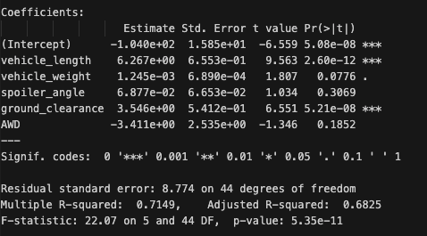
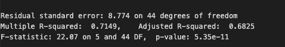
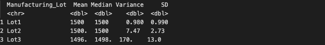
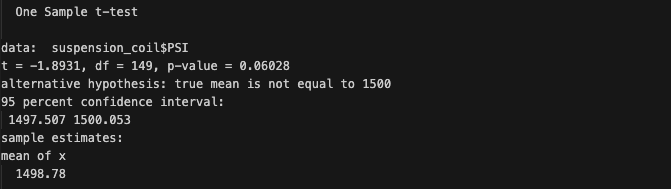
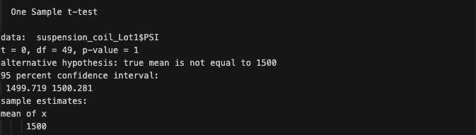
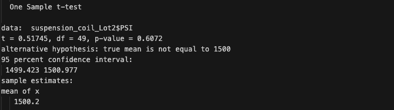
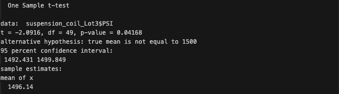

# MechaCar_Statistical_Analysis

## Overview of the Statistical Analysis

An analysis of data using multiple linear regression, T-tests, and summary statistics on various parameters to compare the performance of MechaCar cars with that of other manufacturers.

## Resources 
### Data Sources: 
We used the following [Suspension_Coil](Resources/Suspension_Coil.csv) & [MechaCar_mpg](Resources/MechaCar_mpg.csv) to complete the technical analysis.

### Softwares:

## Deliverable 1: Linear Regression to Predict MPG

After performing Linear Regression Analysis on the [MechaCar_mpg](Resources/MechaCar_mpg.csv) we addressed the below:

- ***Which variables/coefficients provided a non-random amount of variance to the mpg values in the dataset?***

According to our results, **vehicle length and ground clearance (as well as intercept)** are statistically unlikely to provide random amounts of variance to the linear model as Pr(>|t|) for vehicle length and ground clearance is ~ 0 the lesser the Pr(>|t|) the lesser the chance of variable causing a variance in mpg randomly. 

- ***Is the slope of the linear model considered to be zero? Why or why not?***

Since the equation has Multiple variable, and all has coefficients hence the slope cannot be equal to Zero.

     mpg = (6.267)vehicle_length + (0.0012)vehicle_weight + (0.0688)spoiler_angle + (3.546)ground_clearance + (-3.411)AWD + (-104.0)

- ***Does this linear model predict mpg of MechaCar prototypes effectively? Why or why not?***

R-squared value explains the hiw accurately the regression analysis variables explains the correlation. In this case Multiple R-squared can explain 71.49% effectively and Adjusted R-squared: 68.25%. Hence it is not 100% effective but still ~70% can be explained by these 5 variables.

## Deliverable 2: Create Visualizations for the Trip Analysis 

***The design specifications for the MechaCar suspension coils dictate that the variance of the suspension coils must not exceed 100 pounds per square inch. Does the current manufacturing data meet this design specification for all manufacturing lots in total and each lot individually? Why or why not?***

As per the above summary the current Variance of the data is 62.29356 which is under 100 pounds per square inch. Hence, the current manufacturing data did meet this design specification for all manufacturing lots in **total**.

As per the above summary the current Variance of the data in Lot 1 & 2 is less than 100 pounds per square inch but for Lot 3 the Variance exceeds the target. Hence, the current manufacturing data did not meet this design specification for all manufacturing lots in **individually** just for Lot 3 standing at ~ 170.28 pounds per square inch.

## Deliverable 3: T-Tests on Suspension Coils

To evaluate whether any manufacturing lots, as well as each lot individually, deviate statistically from the population mean of 1,500 pounds per square inch, t-tests are utilised. **Only Manufacturing Lot 3** is discovered to statistically vary from the population mean.

### **One Sample t-Test across all manufacturing Lots**

- Reviewing the T-test findings for all manufacturing lots of suspension coils reveals that they are not statistically different from the population mean, and as the p-value is bigger than .05 and is 0.06028, we **fail to reject** the null hypothesis.

### **One Sample t-Test for 'Lot 1'**

- Reviewing the T-test findings for all manufacturing lots of suspension coils reveals that they are not statistically different from the population mean, and as the p-value is bigger than .05 and is 1, we **fail to reject** the null hypothesis.

### **One Sample t-Test for 'Lot 2'**

- Reviewing the T-test findings for all manufacturing lots of suspension coils reveals that they are not statistically different from the population mean, and as the p-value is bigger than .05 and is 0.6072, we **fail to reject** the null hypothesis.

### **One Sample t-Test for 'Lot 3'**

- Reviewing the T-test findings for all manufacturing lots of suspension coils reveals that they are statistically different from the population mean, and as the p-value is lower than .05 and is 0.04168, we **reject** the null hypothesis.

## Deliverable 4: Study Design: MechaCar vs Competition

Statistical study that can quantify how the MechaCar performs against the competition basis 

### **Metrics**

- Cost
- City or highway fuel efficiency
- Horse power
- Maintenance cost
- Safety rating

### **Hypothesis**

- *Null Hypothesis* - MechaCar pricing is no different from that of the competitors
- *Alternative Hypothesis* - MechaCar pricing is different (under-priced or over-priced) from that of the competitors

### **Statistical Test to test the hypothesis**

The variables with the highest correlation to price or the combinations of variables that have the most effects on price should be determined using a **multiple linear regression**.

### **Dataset for the statistical test**

For MechaCar and their competitors for the identical models, a random sample of vehicles would need to be gathered, including information on safety ratings, highway fuel efficiency, horsepower, maintenance costs, safety ratings, resale value, etc.

